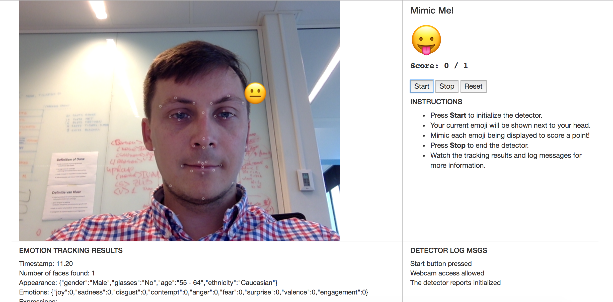
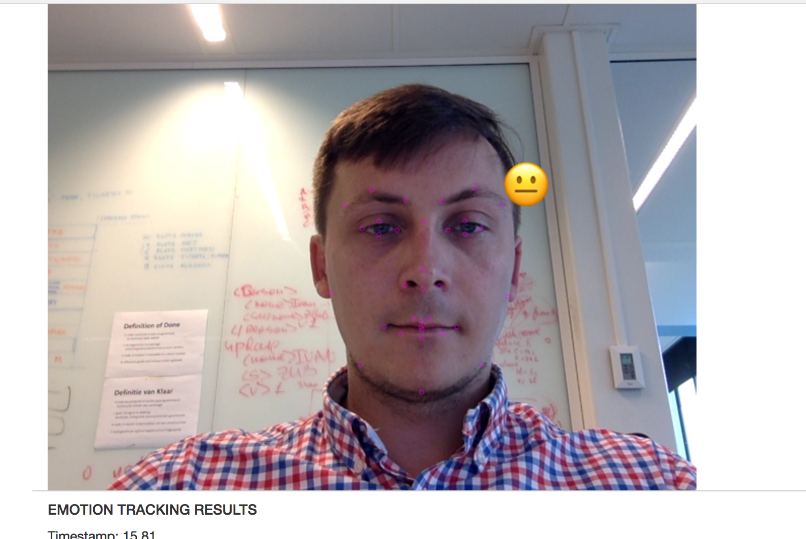
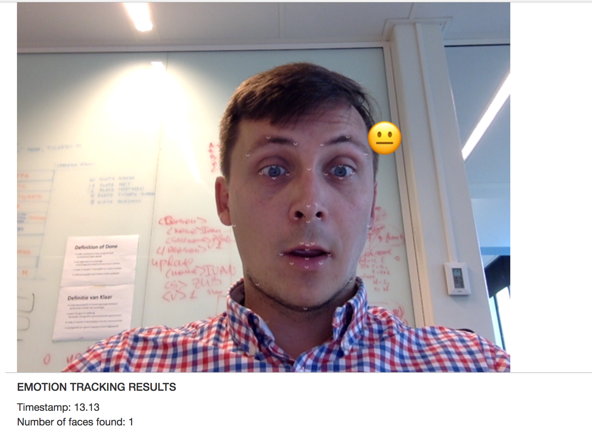
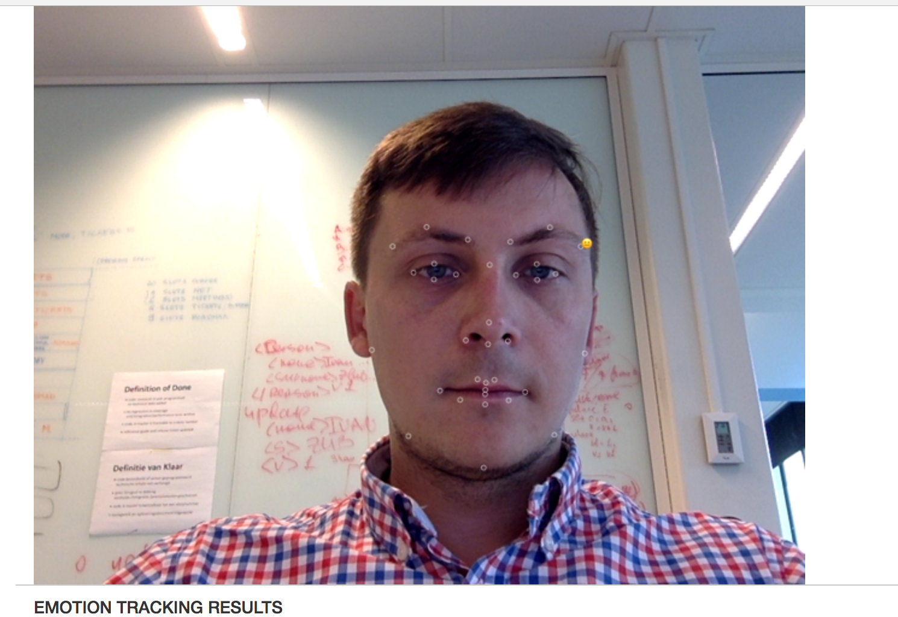
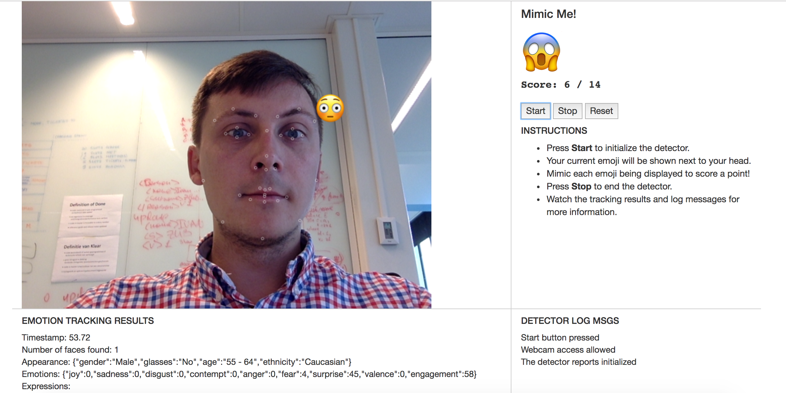

# Mimic Me! report by Yevgen Nerush

This report outlines the rules and implementation of the very
simple game called Mimic Me!

## Rules of the game
When game is started, there is only 5 seconds to mimic emoji
displayed on the upper-right corner. If emoji is successfully
mimicked, current score is increased by 1 and new random emoji
is generated to be mimicked. It is worth to mention that for each
randomly generated emoji the total score is also increased by 1.

### (optional) You can restart the game as well
In order to reset the game, first thing that we need to to is
to set correct and total emoji scores to 0. Second, we need to
generate new random emoji and reschedule random emoji generation
routine for new game.

### (optional): Call a function to initialize the game, if needed
As new emojies should be randomly generated by schedule, the emoji random generator is scheduled when the detector is initialized and ready for running.

### Call your function to run the game (define it first!)
When face and its features are successfully detected, we delegate
dominante emoji to `play` function, which is responsible for checking whether mimicked emoji matches randomly generated one. If unicode codes
of mimicked and generated emojies are equal, `play` function increases both correct and total scores, assignes new random emoji and reschedules emoji generation routine.



### Set the stroke and/or fill style you want for each feature point marker
It is very simply to do with Context API. Just assign RGBA value to the
`strokeStyle` property of the `context`, where RBGA stands for RED, GREEN, BLUE and ALHPA channels.



### Draw feature point, e.g. as a circle using ctx.arc()
Its very easy to draw arc with`Context` API. What we need to do is to draw arc for each feature point of the given face using code snippet listed below:

```
ctx.beginPath();
ctx.arc(x,y,2,0,2*Math.PI);
ctx.stroke();
```
where x and y represent coordinate of the face feature, `2` stands for the radius of the circle, `0` stands for the starting angle in radians to start drawing from. The last argument represents `360` degrees in radians to complete the drawing started with the third argument. No magic, just simple school math.



### Set the font and style you want for the emoji
It is very easy to draw emoji as text. Just set the desired font first:

```
ctx.font = '48px serif';
```
### Draw it using ctx.strokeText() or fillText()
Very simple, just call standard `Context` API to draw the text:

```
ctx.fillText(emoji, x, y);
```

where `emoji` argument represents dominant emoji, x and y represent the point where it should be rendered. As all the features of the face have statically defined indices, we use coordinates of one of the rightmost features with index `10`.



### Define any variables and functions to implement the Mimic Me! game mechanics
Here we define `correct` and `total` variables to track emoji recognition process. There is one more `timeoutHandle` custom variable, which is used for random emoji generation routine rescheduling. Along with variables, there are three companion functions: `getRandomEmoji` for random emoji generation, `play` for mimicked emoji recognition and `generateRandomEmoji` for scheduling random emoji generator.


